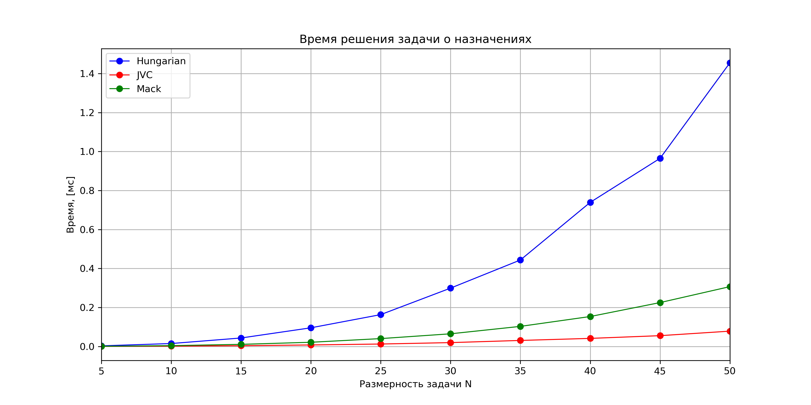
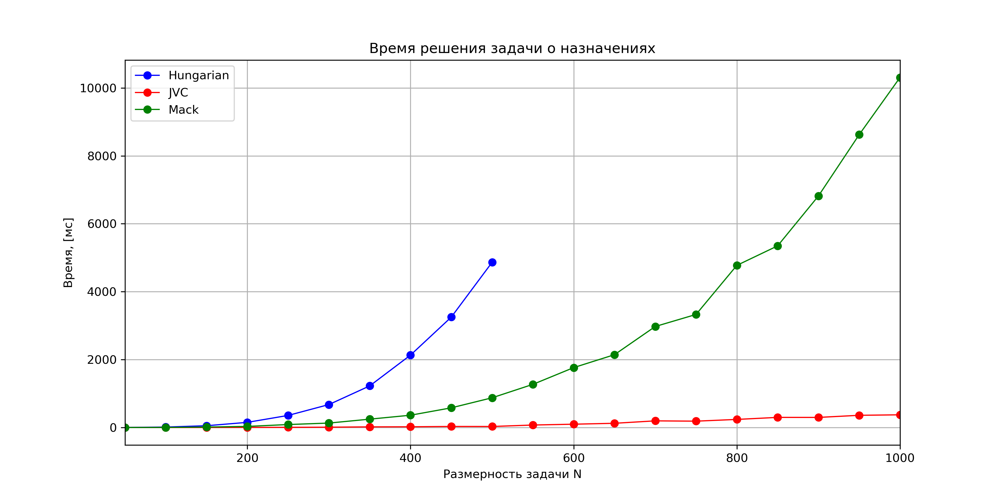

# LAP Linear Assignment Problem #

***

## 1. Brief ##
  Solving linear assignment problem using:
* Jonker-Volgenant-Castanon method (JVC);
* Mack method;
* Hungarian (Munkres) method.

## 2. Dependencies ##
  Armadillo & BLAS needed for matrices, Boost for testing

## 3. Tests ##
* comparison of calculation speed on 50...5000 Monte-Carlo runs;
* simple assignment problem matrices are provided;
* test JVC algorithm for looping.

***

Results for time measuring:

% \image html  doc/pictures/1.png width=1000
% \image latex doc/pictures/1.png 

Fig.1 - Execution time on small dimensions

***

 

% \image html  doc/pictures/2.png width=1000
% \image latex doc/pictures/2.png

Fig.2 - Execution time on large dimensions

