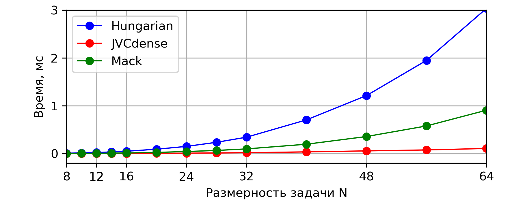
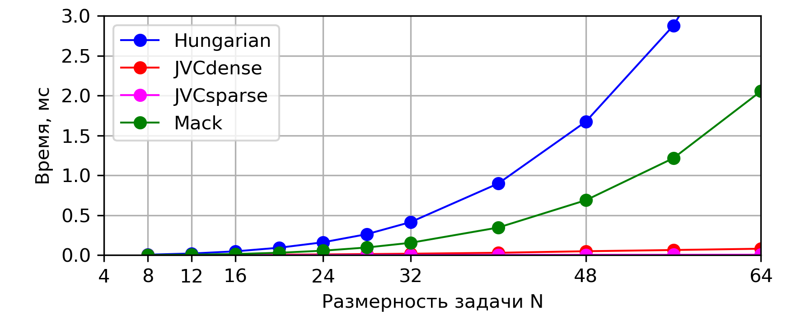
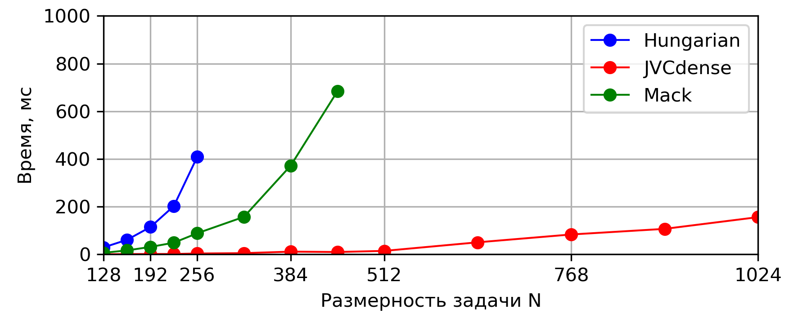
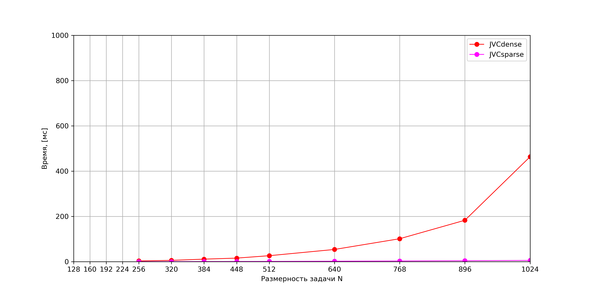
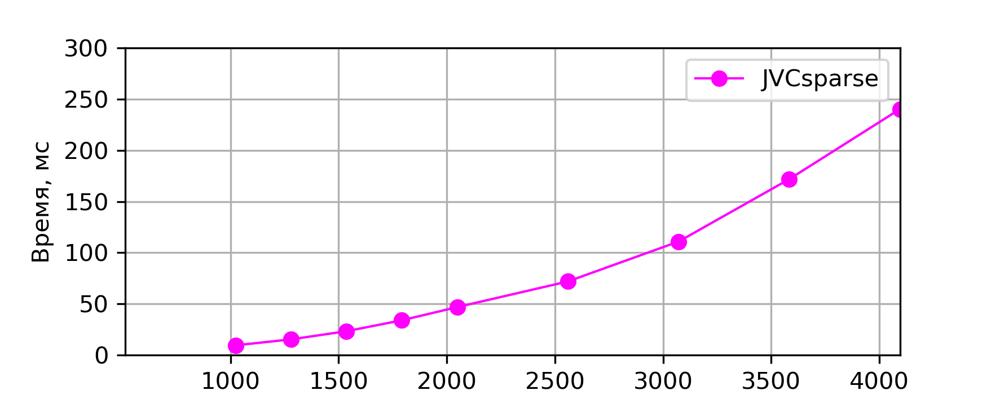
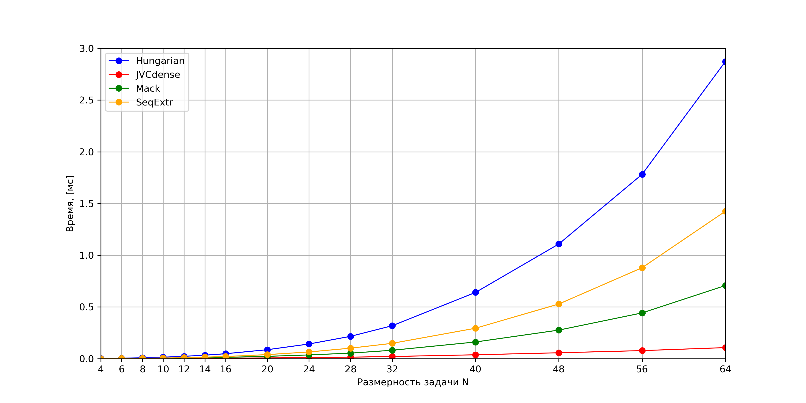
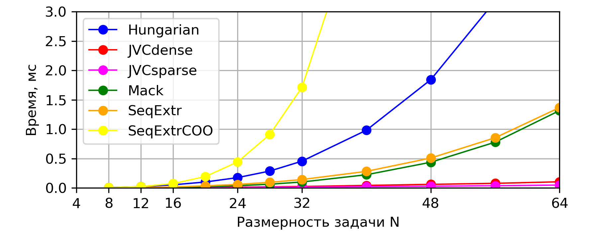

# LAP - Linear Assignment Problem / Линейная дискретная оптимизационная задача (задача о назначениях) #

## 1. Brief / Обзор ##
  Solving linear assignment problem using / Решение задачи о назначениях методами:
* Jonker-Volgenant-Castanon method (JVC) for dense and sparse (CSR - compressed sparse row) matrices / Метод Джонкера-Волгенанта-Кастаньона для плотных и разреженных матриц в CSR формате
* Mack method / Метод Мака
* Hungarian (Munkres) method / Венгерский алгоритм

## 2. References / Ссылки ##
Papers / Статьи:
* R.Jonker and A.Volgenant A Shortest Augmenting Path Algorithm for Dense and Sparse Linear Assignment Problems Computing 38, 325-340 (1987)
* A.Volgenant Linear and Semi-Assignment Problems: A Core Oriented Approach
* Банди Б. Основы линейного программирования: Пер. с англ. - М.:Радио м связь, 1989, стр 113-123

Sites / Сайты:
* http://www.assignmentproblems.com/linearAP.htm
* https://www.mathworks.com/matlabcentral/fileexchange/26836-lapjv-jonker-volgenant-algorithm-for-linear-assignment-problem-v3-0

Repositories / Репозитории:
* https://github.com/yongyanghz/LAPJV-algorithm-c
* https://github.com/RcppCore/rcpp-gallery/blob/gh-pages/src/2013-09-24-minimal-assignment.cpp
* https://github.com/fuglede/linearassignment

## 3. Dependencies / Зависимости ##
  Armadillo for matrices, Boost for testing / Armadillo для работы с матрицами, Boost для тестирования.

## 4. Tests / Тесты ##
* Сomparison of calculation speed on dense and sparse matrices / Сравнение скорости работы на плотных и разреженных матрицах
* Simple assignment problem matrices are provided / Дополнительные тесты на простых матрицах
* test JVC algorithm for looping / Тест алгоритма JVCdense на зацикливание

(Sparsity is ~20% / В разреженной матрице ~20% назначенных ячеек)

***

Results for time measuring / Результаты замеров скорости работы:

<?\image html  doc/pictures/denseSmall.png width=1000px?>
<?\image latex doc/pictures/denseSmall.png?> 

Fig.1 - Execution time for dense matrices (small dimensions)  

Рис.1 - Время выполнения на плотных матрицах (малые размернсти) 

***

<?\image html  doc/pictures/sparseSmall.png width=1000px?>
<?\image latex doc/pictures/sparseSmall.png?> 

Fig.2 - Execution time for sparse matrices (small dimensions)   

Рис.2 - Время выполнения на разреженных матрицах (малые размернсти)

***

 
<?\image html  doc/pictures/denseLarge.png width=1000?>
<?\image latex doc/pictures/denseLarge.png?>

Fig.3 - Execution time for dense matrices (large dimensions)   

Рис.3 - Время выполнения на плотных матрицах (большие размерности)

***

 
<?\image html  doc/pictures/sparseLarge.png width=1000?>
<?\image latex doc/pictures/sparseLarge.png?>

Fig.4 - Execution time for sparse matrices (large dimensions)   

Рис.4 - Время выполнения на разреженных матрицах (большие размерности)

***

 
<?\image html  doc/pictures/sparseLargeExtra.png width=1000?>
<?\image latex doc/pictures/sparseLargeExtra.png?>

Fig.5 - Execution time for sparse matrices (large dimensions) for JVCsparse  

Рис.5 - Время выполнения на разреженных матрицах (большие размерности) для JVCsparse

***

Additional graphs pics for methods of sequental extremum for dense and sparse matrices in dense and COOrdinated formats /
Дополнительные графики для методов последовательного выбора экстремума для плотных и разреженных матриц в обычном плотном виде и COO-формате.

***

 
<?\image html  doc/pictures/denseSmallSeqExtr.png width=1000?>
<?\image latex doc/pictures/denseSmallSeqExtr.png?>

Fig.6 - Execution time for dense matrices (small dimensions)  

Рис.6 - Время выполнения на плотных матрицах (малые размерности)

***

 
<?\image html  doc/pictures/sparseSmallSeqExtr.png width=1000?>
<?\image latex doc/pictures/sparseSmallSeqExtr.png?>

Fig.7 - Execution time for sparse matrices (small dimensions)  

Рис.7 - Время выполнения на разреженных матрицах (малые размерности)

## 5. Time measurements tables for sparse matrices / Сводные таблицы замеров времени выполнения для разреженных матриц

Table 1 - Execution time, milliseconds / Таблица 1 - Время выполнения, миллисекунды

<!--Таблица получена из теста time_table-->

| N | 8 | 16 | 32 | 64 | 128 | 256 | 512 | 1024 |
| :-: | :-: | :-: | :-: | :-: | :-: | :-: | :-: | :-: |
| Hungarian | 0.008 | 0.049 | 0.406 | 4.909 | 71.470 | 1405.311 | - | - |
| Mack | 0.003 | 0.015 | 0.176 | 2.063 | 29.290 | 369.917 | - | - |
| SeqExtr | 0.003 | 0.019 | 0.138 | 1.336 | 16.097 | 233.044 | - | - |
| SeqExtrCOO | 0.002 | 0.009 | 0.045 | 0.307 | 2.879 | 41.596 | - | - |
| JVCdense | 0.002 | 0.005 | 0.020 | 0.080 | 0.396 | 3.078 | 25.968 | 523.424 |
| JVCsparse | 0.001 | 0.002 | 0.003 | 0.006 | 0.023 | 0.114 | 1.065 | 4.931 |

***

Table 2 - Increasing execution time relative to JVCsparse (times) / Таблица 2 - Возрастание времени выполнения относительно метода JVCsparse (разы)

<!--Таблица получена из теста time_table-->

| N | 8 | 16 | 32 | 64 | 128 | 256 | 512 | 1024 |
| :-: | :-: | :-: | :-: | :-: | :-: | :-: | :-: | :-: |
| Hungarian | 6.649 | 32.651 | 138.658 | 777.437 | 3053.416 | 12347.003 | - | - |
| Mack | 2.389 | 10.198 | 60.085 | 326.773 | 1251.372 | 3250.076 | - | - |
| SeqExtr | 3.007 | 12.441 | 47.199 | 211.655 | 687.719 | 2047.511 | - | - |
| SeqExtrCOO | 2.100 | 6.218 | 15.341 | 48.560 | 123.016 | 365.459 | - | - |
| JVCdense | 1.542 | 3.247 | 6.852 | 12.613 | 16.930 | 27.045 | 24.380 | 106.155 |

## 6. Conclusion / Вывод

JVCsparse is the fastest method from considered (for sparse matrices), cause it works with compact CSR storage and uses fast JVC algorithm. JVCdense is the fastest for dense.
Method of sequental extremum is non-optimal and it's usage is not recommended.
/ 
JVCsparse самый быстрый метод среди рассмотренных (для разреженных матриц), поскольку работает с матрицами, хранящимися в компактном CSR формате и использует быстрый JVC алгоритм. Для плотных матриц самый быстрый JVCdense.
Метод последовательного выбора экстремума неоптимален и его использование не рекомендуется.
