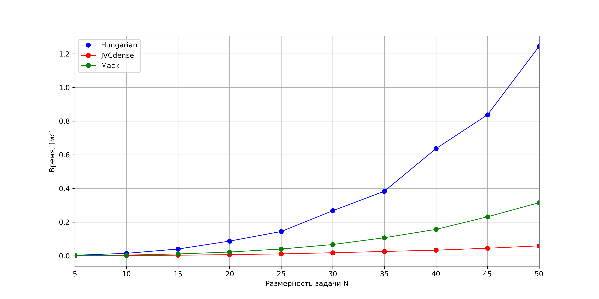
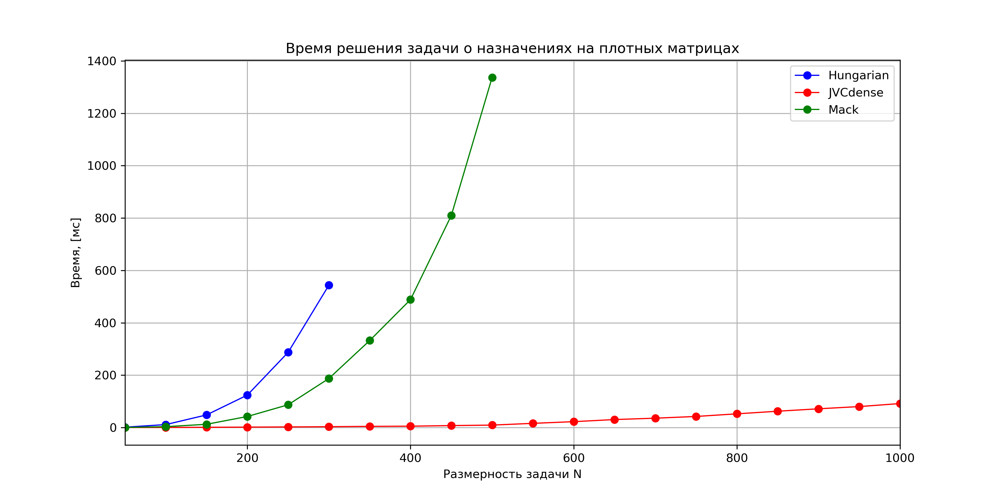
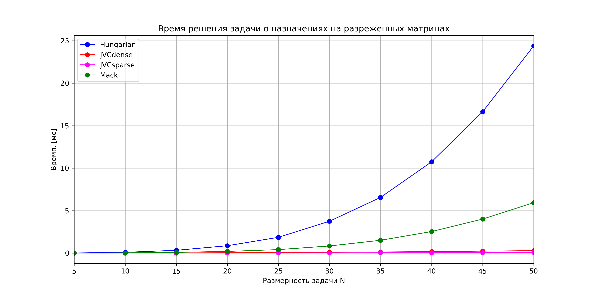
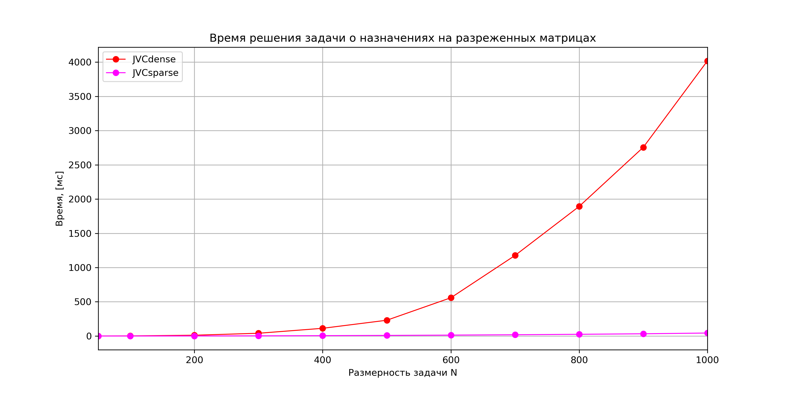
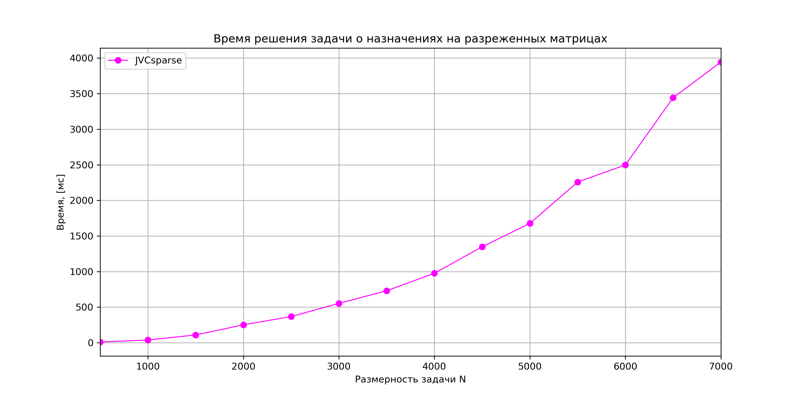

# LAP - Linear Assignment Problem / Линейная дискретная оптимизационная задача (задача о назначениях) #

***

## 1. Brief / Обзор ##
  Solving linear assignment problem using / Решение задачи о назначениях методами:
* Jonker-Volgenant-Castanon method (JVC) for dense and sparse (CSR - compressed sparse row) matrices / Метод Джонкера-Волгенанта-Кастаньона для плотных и разреженных матриц в CSR формате
* Mack method / Метод Мака
* Hungarian (Munkres) method / Венгерский алгоритм

## 2. References / Ссылки ##
Papers / Статьи:
* R.Jonker and A.Volgenant A Shortest Augmenting Path Algorithm for Dense and Sparse Linear Assignment Problems Computing 38, 325-340 (1987)
* A.Volgenant Linear and Semi-Assignment Problems: A Core Oriented Approach
* Банди Б. Основы линейного программирования: Пер. с англ. - М.:Радио м связь, 1989, стр 113-123

Sites / Сайты:
* http://www.assignmentproblems.com/linearAP.htm
* https://www.mathworks.com/matlabcentral/fileexchange/26836-lapjv-jonker-volgenant-algorithm-for-linear-assignment-problem-v3-0

Repositories / Репозитории:
* https://github.com/yongyanghz/LAPJV-algorithm-c
* https://github.com/RcppCore/rcpp-gallery/blob/gh-pages/src/2013-09-24-minimal-assignment.cpp
* https://github.com/fuglede/linearassignment

## 3. Dependencies / Зависимости ##
  Armadillo for matrices, Boost for testing / Armadillo для работы с матрицами, Boost для тестирования.

## 4. Tests / Тесты ##
* Сomparison of calculation speed on dense and sparse matrices / Сравнение скорости работы на плотных и разреженных матрицах
* Simple assignment problem matrices are provided / Дополнительные тесты на простых матрицах
* test JVC algorithm for looping / Тест алгоритма JVCdense на зацикливание

(Sparsity is ~20% / В разреженной матрице ~20% назначенных ячеек)

***

Results for time measuring / Результаты замеров скорости работы:

<?\image html  doc/pictures/dense5to50.png width=1000px?>
<?\image latex doc/pictures/dense5to50.png?> 

Fig.1 - Execution time for dense matrices (small dimensions)  

Рис.1 - Время выполнения на плотных матрицах (малые размернсти) 

***

 
<?\image html  doc/pictures/dense50to1000.png width=1000?>
<?\image latex doc/pictures/dense50to1000.png?>

Fig.2 - Execution time for dense matrices (large dimensions)   

Рис.2 - Время выполнения на плотных матрицах (большие размерности)

***

<?\image html  doc/pictures/sparse5to50.png width=1000px?>
<?\image latex doc/pictures/sparse5to50.png?> 

Fig.3 - Execution time for sparse matrices (small dimensions)   

Рис.3 - Время выполнения на разреженных матрицах (малые размернсти)

***

 
<?\image html  doc/pictures/sparse50to1000.png width=1000?>
<?\image latex doc/pictures/sparse50to1000.png?>

Fig.4 - Execution time for sparse matrices (large dimensions)   

Рис.4 - Время выполнения на разреженных матрицах (большие размерности)

***

 
<?\image html  doc/pictures/sparse500to7000.png width=1000?>
<?\image latex doc/pictures/sparse500to7000.png?>

Fig.5 - Execution time for sparse matrices (large dimensions) for JVCsparse  

Рис.5 - Время выполнения на разреженных матрицах (большие размерности) для JVCsparse

